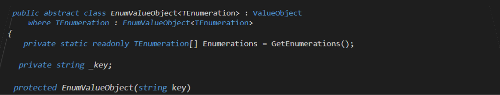

# 
<h1>Welcome</h1>

Hey lot, my name is Steven and I am a .NET developer based in Zurich.
Welcome to my public page. I am most likely interested in new technologies. If you want to know more just check out the links down below.

I also have a blog [here](https://steven-giesel.com/) and if you are interested in the source code of it, [here](https://github.com/linkdotnet/Blog) you go.

# Social

# Github

